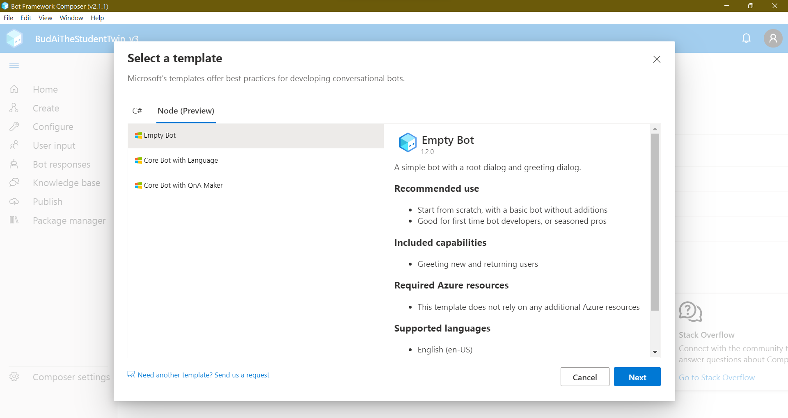
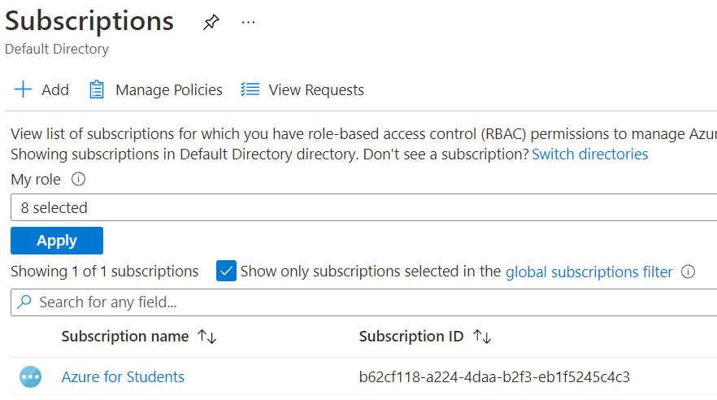

# Bud.ai – The Student Twin ✨

## Introduction 

### Project Title : 
Bud.ai – The Student Twin

### Project Statement/Opportunity : 

The education sector in India has been undergoing massive transformations, with pandemics causing shocks to the system, institutions being forced to close, and students transitioning to online learning. Due to school and college closures, approximately 250 million students were impacted. CoVID-19 also acted as a catalyst for digital adoption in educational institutions, forcing them to implement a remote learning solution as soon as possible. However, quick fixes aren't always feasible or student-friendly. Zoom, for example, has caused upheaval in the video-meeting space but does not provide an in-out learning ecosystem. This is where integrating academic solutions that assist students in managing academics on a single platform becomes pivotal. Microsoft Teams enables the integration of custom learning management solutions, resulting in effective learning. Our goal is to create a bot solution that allows students to manage their academics in a single platform, such as Microsoft Teams, with no extra effort.

### Project Description :

The impact of the CoVID-19 Pandemic on education is both unprecedented and widespread in education history, impacting every student in the world. The **unexpected arrival of pandemic** and subsequent school closures saw massive efforts and more technical implementations to the education system to **deliver continued education** around the world. These changes were made very quickly as the prevailing circumstances demanded. Overnight, many schools and education systems began to offer education remotely. Through television, the internet and every other medium that reached the masses. Regardless of the outcomes, **remote learning** through **video meetings** has become the de-facto method of delivering education for more than a year now. However, the remote education through video meetings also has its downsides. The students in one hand are advised to attend online meetings at one space, and access the educational resources somewhere else on the other hand. This cluttered, unfriendly **learning ecosystem** can be coped up by senior students but junior students feel it’s too difficult for them to navigate to **different platforms to access different tasks** and it also causes **digital divide**. This is where merging the gap and **unifying the learning ecosystem** becomes the need of the hour. Here’s where we leverage Microsoft’s flagship product ‘**Microsoft Teams**' and use it’s integration abilities to implement an **academic conversational experience** through Azure Bot Services leveraging ‘Azure Bot Services’, ‘Azure Cognitive Services’ cloud technologies altogether, to provide students the instant access to most important academic details like Profile Summary, Attendance, Everyday Schedule, Subject List, Teachers Contact Details and much more to enable hassle-free experience to their remote learning **under single umbrella** MS Teams, accessible in both mobile, web and desktop versions.

### Primary Azure Technologies : 

1. [Azure Bot Service](https://azure.microsoft.com/en-us/services/bot-services/#overview)
2. [Azure Cognitive Services](https://azure.microsoft.com/en-in/services/cognitive-services/)
3. [Azure App Service](https://azure.microsoft.com/en-in/services/app-service/)

### Other Azure Technologies (if any):

* [Azure QnA Maker](https://azure.microsoft.com/en-in/services/cognitive-services/question-answering/)
* [Azure LUIS (Conversational Language Understanding)](https://azure.microsoft.com/en-us/services/cognitive-services/conversational-language-understanding/)
* [Microsoft Bot Framework](https://dev.botframework.com/)
* [Azure Bot Framework Composer](https://docs.microsoft.com/en-us/composer/)
* [Azure CosmosDB](https://azure.microsoft.com/en-us/services/cosmos-db/)
* [Azure Application Insights](https://docs.microsoft.com/en-us/azure/azure-monitor/app/app-insights-overview)

---

## Features

Bud.ai - The Student Twin provides an all-new conversational academic experience merging the digital divide, eliminating the need for different platforms for different academic tasks. The tasks performed by our conversational application is classified as 5 different actions, as of now. 

* A learner can access a Quick **1. Summary** card where he/she can
  * access his **Attendance Log, Upcoming Classes, Department Details, School Open/Close Time** instantly.
* A learner can access their **2. Schedules** where
  * the **timetable and class timings** are dynamically fetched according to the day.
  * if there's any **events** planned, the event details will be visible in the schedule according to their respective times.
  * two different cards are displayed dividing the day's schedule into **morning** and **afternoon** sessions, for easy viewing by the learner.
* A learner can view their **3.Subjects** where 
  * A **list of courses enrolled** for the learner will be visible.
  * Along with it, the external **programs/internships** enrolled by the learner will also be visible in this card.
* A learner can also view their **4.Faculty Details** where 
  * their **contact information** will be present, so that they can quickly communicate them for instant doubt clarification or other scope of requirements.
* Finally, an **5. About Me** section added for the project's reference as of now - for explaining what this Bud.ai - Conversational Bot can do. I believe that it will also acts a proof of authenticity that this project is ideated, created and developed by me as a part of Microsoft Future Ready Talent Program.

## Requirements and Gathering

1. [Microsoft Azure Bot Framework Composer](https://docs.microsoft.com/en-us/composer/):

   ​	Bot Framework Composer, built on the Bot Framework SDK, is an open-source IDE for developers to author, test, provision, and manage conversational experiences. It provides a powerful visual authoring canvas enabling [dialogs](https://docs.microsoft.com/en-us/composer/concept-dialog), [language-understanding models](https://docs.microsoft.com/en-us/composer/concept-language-understanding), [QnAMaker Knowledge bases](https://docs.microsoft.com/en-us/composer/how-to-add-qna-to-bot), and [language generation](https://docs.microsoft.com/en-us/composer/concept-language-generation) responses to be authored from within one canvas and crucially, enables these experiences to be extended with code for more complex tasks such as system integration. Resulting experiences can then be tested within Composer and provisioned into Azure along with any dependent resources.

   Composer is available as [a desktop application](https://docs.microsoft.com/en-us/composer/install-composer) for Windows, macOS, and Linux. Once you download it, you can open the application first and create a empty bot project.

   > 

2. [Azure Cloud Account with Active Subscription](https://azure.microsoft.com/en-in/account/) 

   ​	To start building, developing, managing our cloud applications - we first need to [create an account](https://portal.azure.com/) on Microsoft Azure.

   > 

## Project Cost :

  ​	As of 3rd January, 2022 - The app has been hosted on Azure for 9 days now. From my $100 dollar Azure Students Credit - 72$ has already got consumed - which is roughly around 5000 INR. 

  > 

